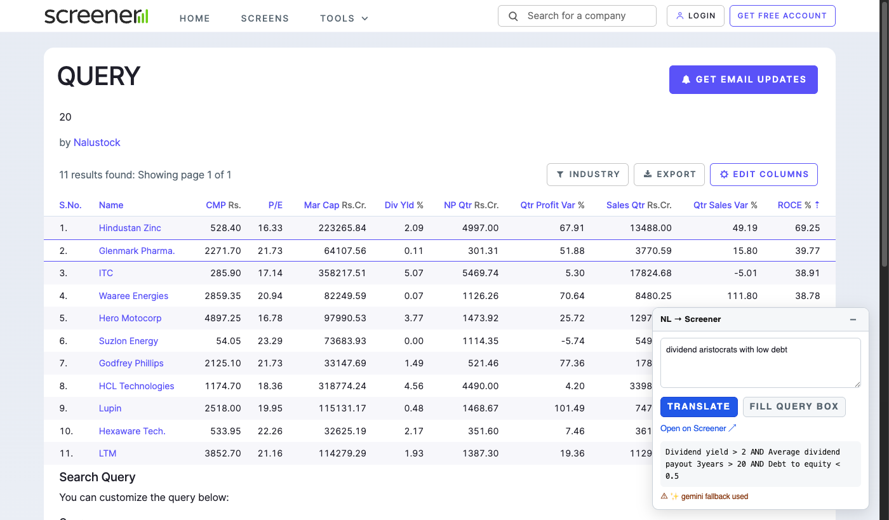
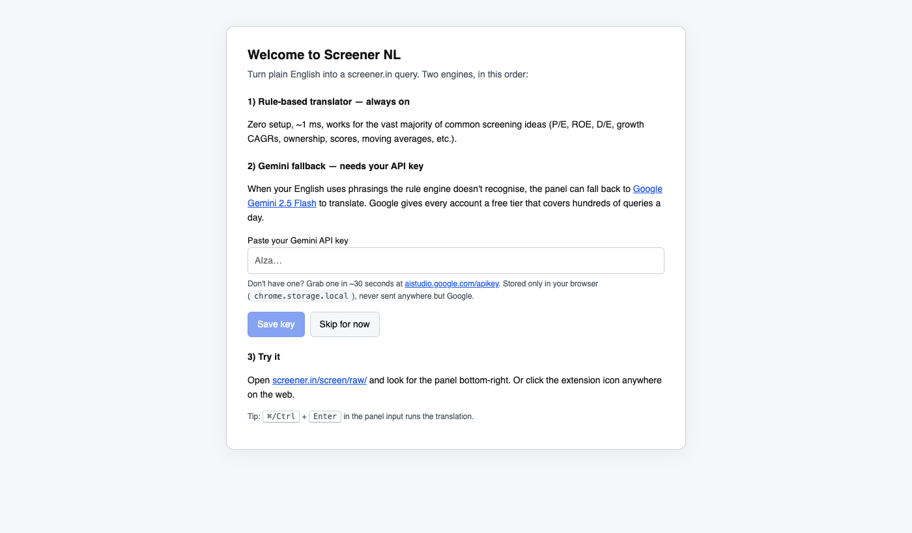
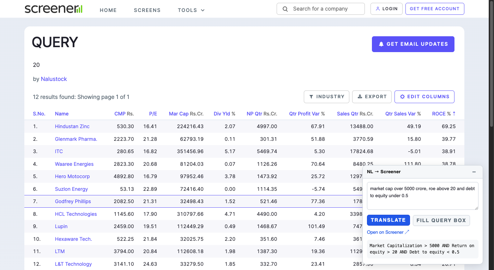

# Screener NL Query

Type stock-screening ideas in plain English on [screener.in](https://www.screener.in) — get a valid query.

## Install

- **Chrome Web Store** — coming soon (in review)
- **Sideload** — grab `screener-nl-*.zip` from the [latest release](../../releases/latest), unzip, then in your browser: `chrome://extensions` → toggle **Developer mode** → **Load unpacked** → point to the unzipped folder.

Works on any Chromium browser with MV3 support (Chrome, Brave, Edge, Arc, Vivaldi).

## What you get

1. **Rule-based translation** — instant, offline, covers the common stuff (P/E, ROE, D/E, growth CAGRs, ownership, Piotroski, DMA, `between X and Y` ranges, and variable-on-RHS comparisons).
2. **LLM fallback (BYOK)** — when your English is colloquial ("dividend aristocrats", "compounders", "monopoly moats"), plug in your own API key from any of:
    - Google Gemini · default `gemini-2.5-flash-lite` (has a free tier)
    - OpenAI · default `gpt-5-nano`
    - Anthropic Claude · default `claude-haiku-4-5`
    - DeepSeek · default `deepseek-v4-flash`
   
   Everything runs locally in your browser; only the specific provider you selected ever receives your input.

## Screenshots

| First run — pick a provider | Rules-only success | LLM fallback |
| :---: | :---: | :---: |
|  |  |  |

## Privacy

Nothing leaves your machine except (a) the English string you type, sent only to the LLM provider you chose, using your own key. No analytics, no telemetry, no backend. Full policy in [PRIVACY.md](PRIVACY.md).

## License

MIT — see [LICENSE](LICENSE).
