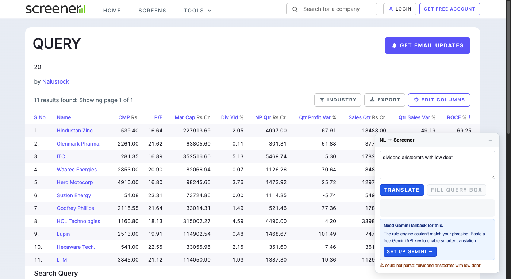
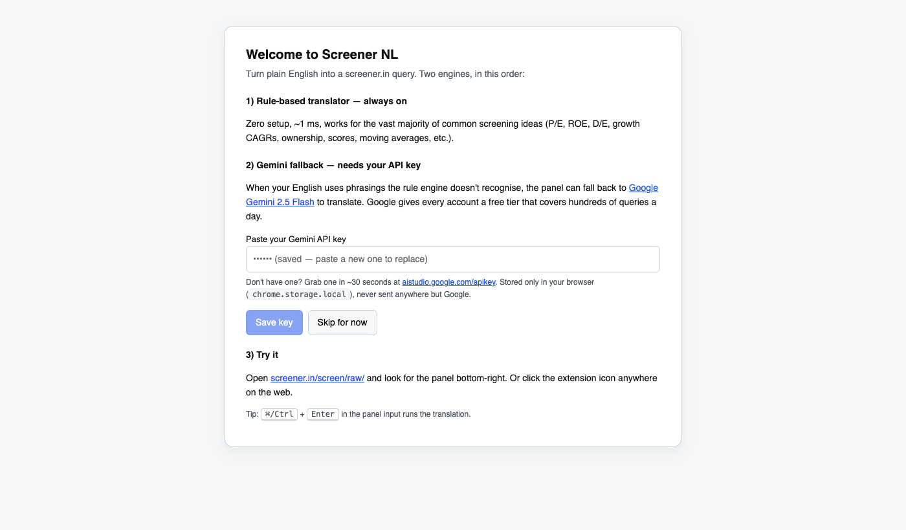
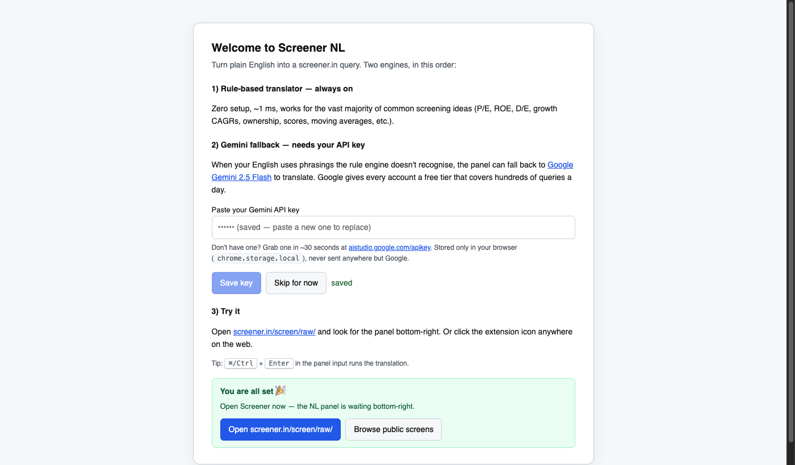

# Screenshots — Screener NL extension

Captured end-to-end from a real Brave 149 window with the extension side-loaded (`--load-extension`).
Same JS runs in Chrome/Edge/Arc/Vivaldi — any Chromium browser with MV3 support.

## 1. Fresh install — welcome page auto-opens
Background service worker fires `chrome.tabs.create({url: welcome.html})` on `onInstalled({reason:"install"})`.

## 2. Rules fail + no key → "Set up Gemini →" card
When the panel can't parse an idea like *"dividend aristocrats with low debt"* and no Gemini key is saved,
the panel surfaces a blue setup card. Clicking `SET UP GEMINI →` fires a runtime message that opens the
options/welcome page.

## 3. Rules-only success (no key needed)
For anything the rule engine can express — market cap, ROE, D/E, growth CAGRs, DMAs, etc. —
translation is ~1 ms and offline.

## 4. Welcome page when a key is already saved
The input placeholder switches to `•••••• (saved — paste a new one to replace)`.

## 5. "You're all set 🎉" CTA — appears after Save or Skip
Two buttons: **Open screener.in/screen/raw/** and **Browse public screens**.

## 6. Gemini fallback in action
When rules fail and a key is stored, `translator.js` calls `generativelanguage.googleapis.com` with a
system prompt that lists every ontology variable + few-shot approximations. Gemini's output is
validated against the ontology; unknown variables are rejected before display.

## How they were captured

Every screenshot came from `extension/tools/snap.mjs` (a CDP `Page.captureScreenshot` wrapper).
Reproducing them is a matter of running the browser with `--remote-debugging-port=9222` and calling
the tool with a URL substring — see `extension/tools/verify-in-browser.mjs` and `extension/tools/run-nl.mjs`
for the exact end-to-end scripts used during this session.
